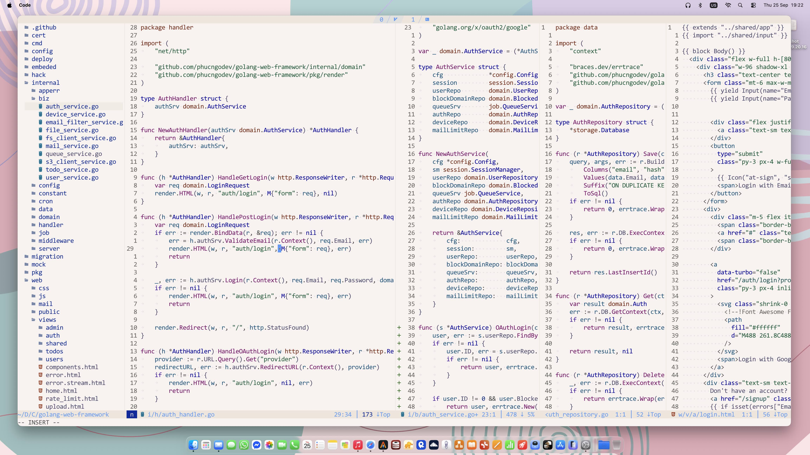
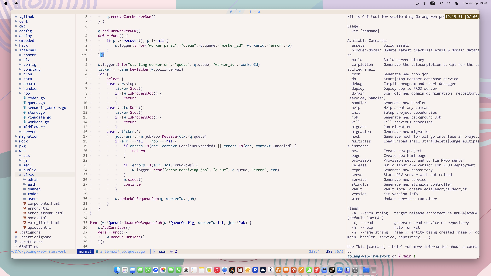
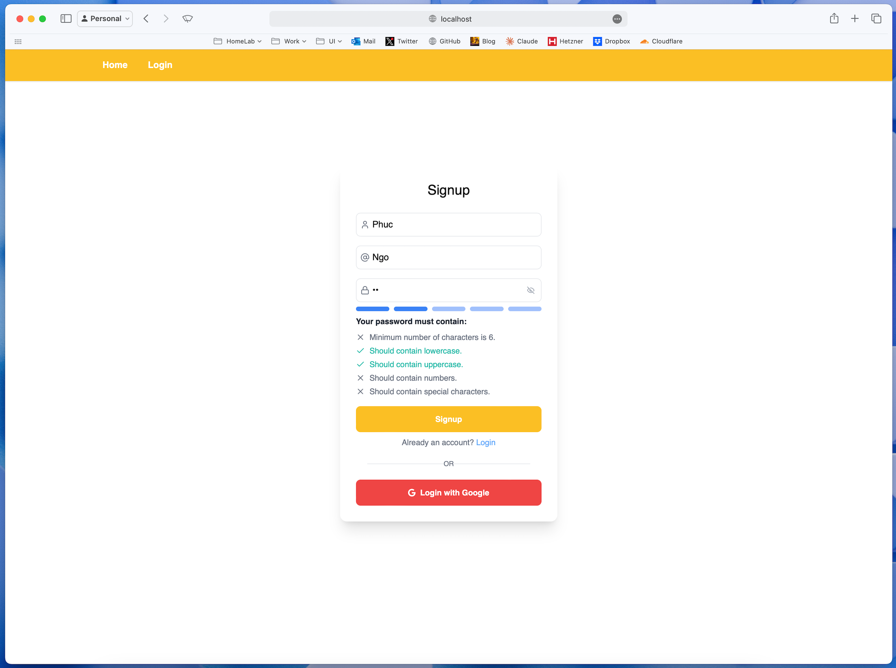

# About Me

Hey I'm Phuc, I'm cooking a new Golang framework.





# Introduction

A Go web application framework template designed to accelerate development of production-ready web applications. It provides a solid foundation with best practices, common utilities, and integrations for building scalable web services.

## Features
- Go 1.25+
- Chi Router
- sqlx
- Jet Templating
- Uber Config
- SCS (Session Management)
- nosurf (CSRF Protection)
- httprate (Rate Limiting)
- Hotwired (Turbo/Stimulus)
- Vite
- Tailwind CSS
- Mailgun / Resend
- AWS S3 SDK
- melody (WebSockets)
- cron (Task Scheduling)
- goose (Database Migrations)
- slog-chi (Structured Logging)
- Ansible (Deployment)


## Project Structure

```
.
├── cmd/
│   ├── kit/           # CLI tools for project management
│   └── server/        # Main application entry point
├── internal/
│   ├── biz/           # Business logic components
│   ├── config/        # Configuration management
│   ├── data/          # Data access layer
│   ├── domain/        # Domain models
│   ├── handler/       # HTTP handlers
│   ├── middleware/    # Custom middleware
│   ├── server/        # Server initialization
│   └── ...            # Other internal packages
├── web/               # Static assets and compiled binaries
├── config/            # Configuration files
├── deploy/            # Deployment scripts
└── ...
```

## Key Files & Directories

- **`cmd/server/main.go`**: Main application entry point.
- **`internal/handler/routes.go`**: HTTP route definitions.
- **`internal/domain/`**: core domain definition.
- **`internal/biz/`**: business logic implementation.
- **`internal/data/`**: database repositories impplementation of core domain repository outbox.
- **`internal/handler/`**: folder contains http handlers.
- **`internal/cron/`**: folder contains cronjob.
- **`internal/job/`**: folder contains job queue and job worker implementation.
- **`config/`**: Application configuration files.
- **`migration/`**: Database migration files.
- **`web/views/`**: Jet template files.
- **`web/js/`**: frontend javascript, hotwired.js and stimulus controller files.
- **`web/assets/`**: Frontend asseets build folder (JS, CSS).
- **`kit.toml`**: `kit` CLI configuration.

## System Requirements

- Go 1.25+
- MariaDB 11.4+ (or compatible MySQL)
- Node.js (for building frontend)
- Ansible (optional, for production deployment)

## Key Commands

The framework includes a CLI tool (`kit`) for common tasks:

| Command         | Description                                      |
| --------------- | ------------------------------------------------ |
| `kit init`      | Initialize project dependencies.                 |
| `kit serve`     | Start the development server with hot reloading. |
| `kit build`     | Build the production binary.                     |
| `kit debug`     | Start a debugging session.                       |
| `go test ./...` | Run all tests.                                   |
| `npm run build` | Build frontend assets.                           |
| `kit provision` | Provision the production server.                 |
| `kit deploy`    | Deploy the application.                          |
| `kit domain -n NAME`    | Generate new domain file.                          |
| `kit repo -n NAME`    | Generate new database repository file.                          |
| `kit service -n NAME`    | Generate new business service file.                          |
| `kit handler -n NAME`    | Generate new http handler file.                          |
| `kit job -n NAME`    | Generate  new job queue worker file file.                          |
| `kit cron -n NAME`    | Generate cron job file.                          |
| `kit migration -n NAME`    | Generate database migration file.                          |
| `kit migrate up/down/reset`    | Run datbase migration.                          |


## Quick Start

### Local Setup

1. Install dependencies:

   ```bash
   brew install go nodejs ansible mysql@8.4
   ```

> [!TIP]
> Why not using docker, well develop on local is blazing fast. but you can use docker if you want.

2. Create a new project:

   ```bash
   kit new -n blog -p github.com/username/blog
   ```

3. Generate local configuration:

   ```bash
   kit vault local
   ```

4. Initialize project dependencies:

   ```bash
   kit init
   ```

5. Start development server:
   ```bash
   kit serve
   ```

### Development Workflow

- ```kit serve``` starting dev server with hot reload for both backend and frontend which enable by default.
- Debugging can be started with:
  ```bash
  kit debug
  ```

## Deployment

### Production Deployment

1. Provision production server:

   ```bash
   kit provision
   ```

2. Deploy to production:
   ```bash
   kit deploy          # For ARM64 servers
   kit deploy -a amd64 # For AMD64 servers
   ```

## Configuration

Configuration is managed through:

1. Environment variables
2. TOML configuration files in the `config/` directory
3. Encrypted vault files managed by the `kit vault` command

## Database Migrations

Database migrations are handled by kit CLI tol:

```bash
# Create new migration
kit migration -n NAME # create new migration file

# Apply migrations
kit migrate up|down|reset # run migration

```

## Testing

Run tests with:

```bash
go test ./...
```

For integration tests requiring a testcontainer, make sure you have docker is running.
