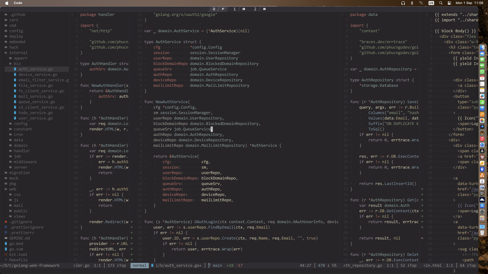
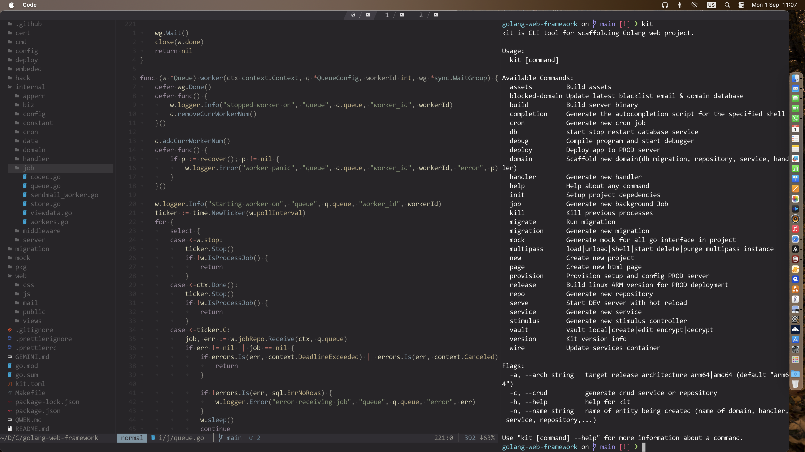
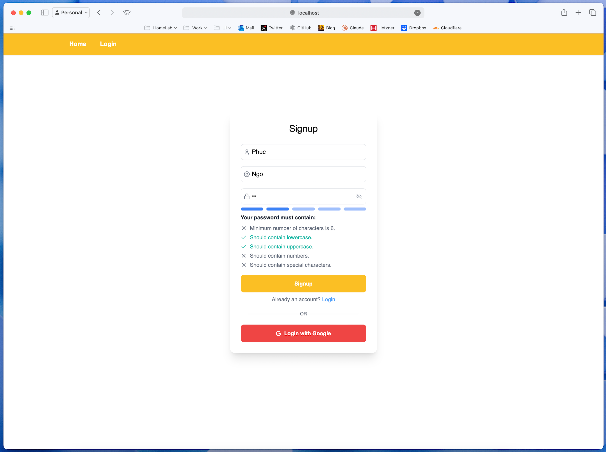

# About Me

Hey I'm Phuc, I'm cooking a new Golang framework.





# Introduction

A Go web application framework template designed to accelerate development of production-ready web applications. It provides a solid foundation with best practices, common utilities, and integrations for building scalable web services.

## Features

- **Web Framework**: Built on top of [Chi router](https://github.com/go-chi/chi) for high performance routing
- **Database Integration**: Uses [sqlx](https://github.com/jmoiron/sqlx) with MySQL driver for database operations
- **Configuration Management**: Powered by [go-uber/config](https://github.com/uber-go/config) for environment-specific configurations
- **Session Management**: Integrated with [SCS](https://github.com/alexedwards/scs) for session handling
- **Validation**: Uses [ozzo-validation](https://github.com/go-ozzo/ozzo-validation) for data validation
- **Security**: Includes CSRF protection with [nosurf](https://github.com/justinas/nosurf) and rate limiting with [httprate](https://github.com/go-chi/httprate)
- **Templating**: Supports [Jet](https://github.com/CloudyKit/jet) template engine
- **Javascript**: Hotwired [Hotwired](https://github.com/CloudyKit/jet) Javascipt framework.
- **Authentication**: OAuth2 integration with Google and GitHub
- **Email Services**: Integrated with Mailgun and Resend for email delivery
- **Storage**: AWS S3 integration for file storage
- **Real-time Communication**: WebSocket support with [melody](https://github.com/olahol/melody)
- **Task Scheduling**: Cron job support with [cron](https://github.com/robfig/cron)
- **Database Migrations**:
- **Logging**: Structured logging with slog-chi integration
- **Deployment**: Ansible-based deployment scripts for production environments
- **Development Tools**: Hot reloading for both backend and frontend
- **Debugging**: Debugging with [delve](https://github.com/go-delve/delve)
- **CLI**: Framework has it own CLI tool called kit which help accelerate the development.

## Project Structure

```
.
├── cmd/
│   ├── kit/           # CLI tools for project management
│   └── server/        # Main application entry point
├── internal/
│   ├── biz/           # Business logic components
│   ├── config/        # Configuration management
│   ├── data/          # Data access layer
│   ├── domain/        # Domain models
│   ├── handler/       # HTTP handlers
│   ├── middleware/    # Custom middleware
│   ├── server/        # Server initialization
│   └── ...            # Other internal packages
├── web/               # Static assets and compiled binaries
├── config/            # Configuration files
├── deploy/            # Deployment scripts
└── ...
```

## System Requirements

- Go 1.25+
- MariaDB 11.4+ (or compatible MySQL)
- Node.js (for frontend assets)
- Make (for build scripts)
- Ansible (optional, for production deployment)

## Quick Start

### Local Setup

1. Install dependencies:

   ```bash
   brew install go nodejs ansible mysql@8.4
   ```

2. Create a new project:

   ```bash
   kit new -n blog -p github.com/username/blog
   ```

3. Generate local configuration:

   ```bash
   kit vault local
   ```

4. Initialize project dependencies:

   ```bash
   kit init
   ```

5. Start development server:
   ```bash
   kit serve
   ```

### Development Workflow

- ```kit serve``` starting dev server with hot reload for both backend and frontend which enable by default.
- Debugging can be started with:
  ```bash
  kit debug
  ```

## Deployment

### Production Deployment

1. Provision production server:

   ```bash
   kit provision
   ```

2. Deploy to production:
   ```bash
   kit deploy          # For ARM64 servers
   kit deploy -a amd64 # For AMD64 servers
   ```

## CLI Tools (kit)

The framework includes a CLI tool (`kit`) for common tasks:

- `kit new` - Create new project from template
- `kit vault` - Manage environment configurations
- `kit init` - Initialize project dependencies
- `kit domain -n NAME` - create new domain
- `kit repo -n NAME` - create new repository.
- `kit service -n NAME` - create new service
- `kit handler -n NAME` - create new handler
- `kit job -n NAME` - create new job
- `kit cron -n NAME` - create new cronjob
- `kit serve` - Start development server
- `kit build` - Build production binary
- `kit provision` - Setup production server
- `kit deploy` - Deploy to production

## Configuration

Configuration is managed through:

1. Environment variables
2. TOML configuration files in the `config/` directory
3. Encrypted vault files managed by the `kit vault` command

## Database Migrations

Database migrations are handled by kit CLI tol:

```bash
# Create new migration
kit migration -n NAME # create new migration file

# Apply migrations
kit migrate up|down|reset # run migration

```

## Testing

Run tests with:

```bash
go test ./...
```

For integration tests requiring a database, make sure MySQL is running with the test database configured.
